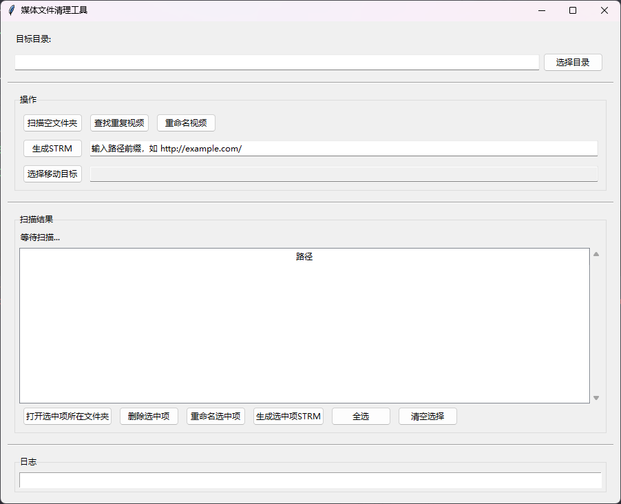

# 媒体文件清理工具

一个用于管理大型媒体文件目录的Python工具，带有图形用户界面。



## 功能

1. **删除空文件夹** - 递归查找并删除所有空文件夹
2. **查找重复视频** - 基于AV番号识别重复的视频文件
3. **重命名视频** - 清理视频文件名，去域名/URL前缀并统一大写格式
4. **生成STRM** - 扫描视频文件，在视频旁边生成 .strm 占位文件，用于视频迁移到其他存储后的引用

## 使用

```bash
python main.py
```

### 功能说明

#### 空文件夹删除
- 从最深层开始扫描，确保删除后父目录被重新检查
- 支持预览模式（仅显示不删除）

#### 重复视频检测
- 支持多种视频格式：.mp4, .mkv, .avi, .mov, .wmv, .flv, .webm
- 基于AV番号识别重复（忽略网址前缀、后缀信息）
- 支持的番号格式：
  - ABC-123
  - AB-123
  - ABC123
  - 000abc-123

#### STRM文件生成
- 输入路径前缀（如 `http://media.example.com/` 或 `\\nas\media\`）
- 扫描目录下所有视频文件，生成同名 .strm 文件
- .strm 内容 = 路径前缀 + 视频文件名
- 例如：前缀 `http://example.com/` + 视频 `ABC-123.mp4` → 生成 `ABC-123.strm`，内容为 `http://example.com/ABC-123.mp4`
- 已有同名 .strm 文件会被覆盖

## 项目结构

```
media-cleaner/
├── main.py         # GUI 主程序入口
├── cleaner.py      # 清理逻辑
├── extractor.py    # AV番号提取逻辑
├── log.py          # 日志配置
└── README.md
```

## 安全提示

- 默认启用预览模式，不会实际删除文件
- 建议先在测试目录上验证功能
- 操作前请备份重要数据
